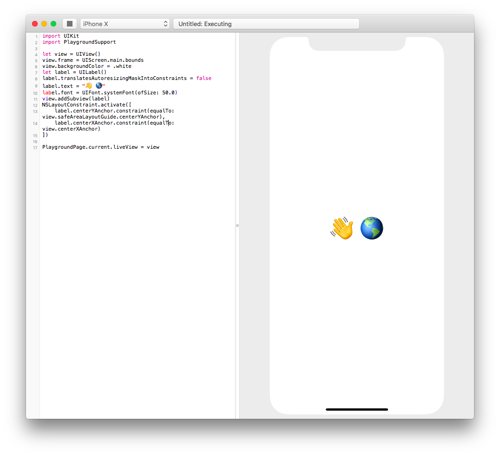

# JungleGym

Reverse-engineered Swift Playgrounds

[](https://travis-ci.org/interstateone/JungleGym)

[Introductory blog post](https://brandonevans.ca/post/text/introducing-junglegym/)

JungleGym is a work in progress, check the [issues](https://github.com/interstateone/JungleGym/issues) for outstanding work or to file bugs and feature requests.



## Requirements

- Xcode 9.x located at `/Applications/Xcode.app`

## Usage

JungleGym is currently only available by building from source.

```sh
git clone git@github.com:interstateone/JungleGym.git
cd JungleGym
git submodule update --init --recursive
open JungleGym.xcworkspace
# Run within Xcode
```

## Credits and Licenses

- [FBSimulatorControl](https://github.com/facebook/FBSimulatorControl): BSD 3-clause
- [LLDBWrapper](https://github.com/eonil/LLDBWrapper): MIT
- [SourceKitten](https://github.com/jpsim/SourceKitten): MIT
- [SWXMLHash](https://github.com/drmohundro/SWXMLHash/): MIT
- [Yams](https://github.com/jpsim/Yams/): MIT

JungleGym is available under the MIT license, see the LICENSE file for more information.
